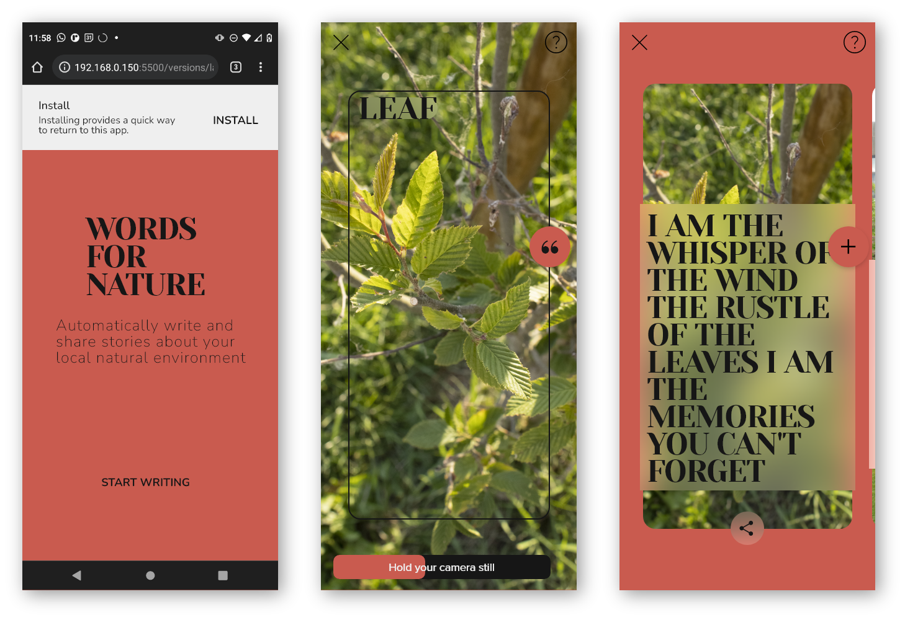

# Words For Nature

> A mobile web application that uses machine learning to talk about nature.
> Live demo [_here_](https://words-for-nature.herokuapp.com/).

## Table of Contents

- [General Info](#general-information)
- [Technologies Used](#technologies-used)
- [Screenshots](#screenshots)
- [Detailed description](#detailed-description)
- [Setup](#setup)
- [Usage](#usage)

## General Information

Words For Nature is a mobile web application that uses the phone camera to detects natural objects in real-time and automatically generate texts using machine learning.  The aim of the project is to connect users to their natural environment.  It's created as a final research project for a bachelor in Creative Technologies at Erasmus University College, Brussel.

## Technologies Used

- express 4.18.1
- node 14.16.1
- ml5
- OpenAI API

## Screenshots

## Detailed description

### Web technology

- [Media Steams API](https://developer.mozilla.org/en-US/docs/Web/API/MediaStream?retiredLocale=nl): get a video stream from the users phone camera to classify
- [requestAnimationFrame](https://developer.mozilla.org/en-US/docs/Web/API/window/requestAnimationFrame): in a loop, the video stream is continuesly drawn on the canvas
- proxyserver: to call the openAI API
- [IndexedDB](https://developer.mozilla.org/en-US/docs/Web/API/IndexedDB_API?retiredLocale=nl): blobs taken from the canvas and generated texts are saved on the client side storage

### AI - real time image classification

- How this app uses image classification:
- A transfer learned version of [mobilenet](https://arxiv.org/abs/1704.04861) is used the brower with [ml5.js](https://learn.ml5js.org/#/reference/image-classifier)
- Transfer learning with [teachable machine](https://teachablemachine.withgoogle.com/)
- The classifier regocnizes 6 classes: flower, plant, leaf, sky, soil, tree and a background class.
- The dataset contains of more then 300 images for each class.

### AI - text generation NLP

- The app uses the [openai API](https://openai.com/api/) to generate texts
- Few shot learning is used to learn the model to generate texts with a specific use of language.
- This means that we design the prompt: pass in a context in the form of examples in order to generate text in a specific tone
- See app.js for how the language model is prompted.

## Setup

To generate texts through the Openai API you need an an API key. 
[Get started with openai](https://openai.com/api/) 
Once you obtained an API key copy paste it in the .env_sample and save it as .env file.

## Usage

After you clone this repo to your desktop, go to its root directory and run `npm install` to install its dependencies. 
Once the dependencies are installed, you can run `npm start` to start the application.  You will then be able to access it at localhost:3000
